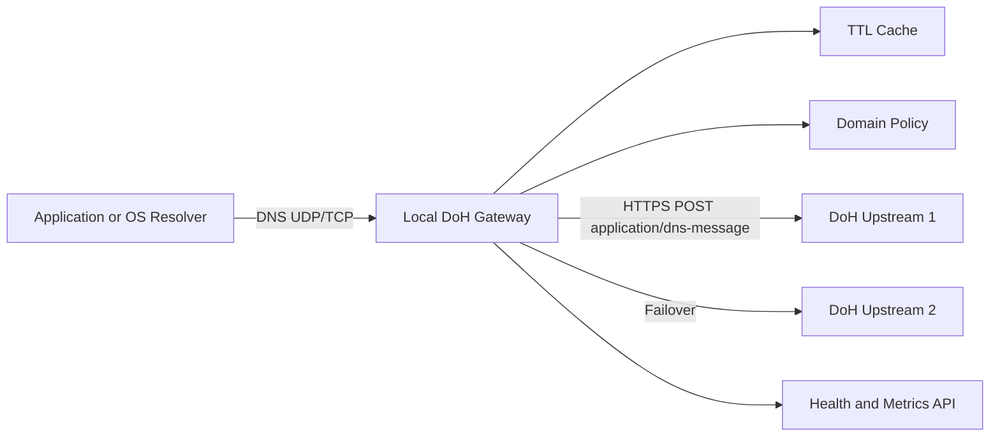
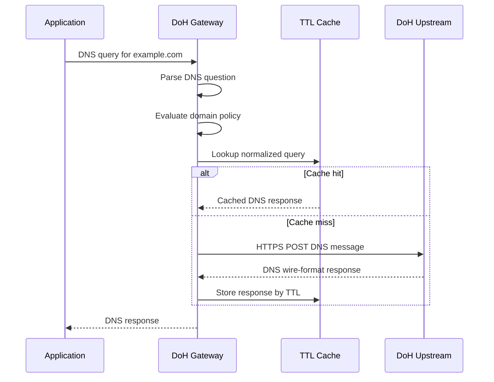

## Build A Local DoH Gateway For Any Application

DNS-over-HTTPS, usually shortened to DoH, encrypts DNS queries between a resolver client and an upstream DNS provider. Many browsers and modern operating systems can use DoH directly, but plenty of applications still know only one DNS interface: a traditional DNS server address.

This guide builds a local gateway for that gap. Applications send normal DNS queries to a local UDP or TCP listener. The gateway forwards those queries to trusted DoH upstreams over HTTPS, then returns the DNS response to the original application.

The design is intentionally practical:

- It listens as a standard local DNS resolver.
- It supports both UDP and TCP DNS clients.
- It forwards queries using `application/dns-message`.
- It caches responses according to DNS TTL values.
- It supports upstream failover.
- It includes basic domain allow and deny policy.
- It exposes `/healthz` and `/metrics` endpoints for operations.

This is not intended for unmanaged public resolver operation or unapproved changes to an organization-wide DNS design. It is a controlled engineering pattern for improving DNS privacy and reliability for applications that do not natively support encrypted DNS.

## Architecture

The gateway sits between local applications and external DoH resolvers.



The local application does not need to understand DoH. It only needs to send DNS queries to the gateway address, such as `127.0.0.1:1053` for development or `127.0.0.1:53` for production.

The gateway handles the rest:

- Parse the DNS packet header and question.
- Apply local allow or deny policy.
- Check the in-memory DNS response cache.
- Forward the original DNS wire-format query to a DoH upstream.
- Cache the upstream response using the response TTL.
- Return the DNS response to the original client.

## Why Use A Gateway Instead Of Native DoH

Native DoH is ideal when an application supports it directly. A gateway is useful when it does not.

Common use cases include:

- Legacy desktop applications that only use the system resolver.
- Internal tools that support custom DNS servers but not DoH URLs.
- Containers that need a DNS server address through Docker networking.
- Lab environments where DNS behavior needs to be centralized and observed.
- Privacy-focused local resolver setups with consistent upstream policy.

The gateway pattern also creates one operational control point. Instead of configuring DoH separately in every app, administrators can monitor, cache, restrict, and update resolver behavior in one place.

## Project Layout

Project repository:

```text
https://github.com/yamangit/doh
```

The implementation is dependency-light and organized around clear service boundaries.

```text
doh-anywhere/
  config/
    example.json
  deploy/
    doh-anywhere.service
  src/
    cache.js
    cli.js
    config.js
    dns-packet.js
    doh-client.js
    logger.js
    metrics.js
    policy.js
    server.js
  test/
    dns-packet.test.js
  Dockerfile
  package.json
  README.md
```

Each module has a focused job:

- `server.js` runs the UDP, TCP, and HTTP listeners.
- `doh-client.js` sends DNS wire-format queries to HTTPS upstreams.
- `dns-packet.js` parses questions, creates error responses, and extracts TTL values.
- `cache.js` stores normalized DNS responses.
- `policy.js` evaluates allow and deny domain rules.
- `metrics.js` renders Prometheus-style service metrics.
- `config.js` loads defaults and validates runtime configuration.
- `cli.js` connects the configuration, logger, and gateway lifecycle.

## DNS Request Flow

A normal DNS request through the gateway follows a predictable path.



The gateway forwards the original DNS packet body to the DoH upstream. This matters because RFC 8484 supports DNS wire-format messages directly. The gateway does not convert DNS into JSON and does not depend on provider-specific APIs.

## Configuration

The service is configured with a JSON file.

```json
{
  "listen": {
    "host": "127.0.0.1",
    "port": 1053,
    "tcp": true,
    "udp": true
  },
  "http": {
    "host": "127.0.0.1",
    "port": 8080
  },
  "upstreams": [
    {
      "name": "cloudflare",
      "url": "https://cloudflare-dns.com/dns-query",
      "timeoutMs": 2500
    },
    {
      "name": "google",
      "url": "https://dns.google/dns-query",
      "timeoutMs": 2500
    }
  ],
  "cache": {
    "enabled": true,
    "maxEntries": 10000,
    "defaultTtlSeconds": 60,
    "minTtlSeconds": 5,
    "maxTtlSeconds": 86400,
    "staleIfErrorSeconds": 300
  },
  "policy": {
    "allowDomains": [],
    "denyDomains": []
  },
  "logging": {
    "level": "info",
    "queryLog": false
  }
}
```

For development, port `1053` avoids common operating system conflicts. For production, many deployments use port `53`, but binding to that port usually requires elevated capability or service configuration.

## DoH Forwarding

The DoH client sends HTTPS `POST` requests with DNS wire-format bytes.

Important request headers:

```text
Accept: application/dns-message
Content-Type: application/dns-message
User-Agent: doh-anywhere/1.0
```

The gateway expects the upstream response to be:

- HTTP success status.
- `Content-Type` containing `application/dns-message`.
- A DNS response body of at least 12 bytes.

If one upstream fails, the client tries the next configured upstream. This gives the service basic resolver resilience without requiring a load balancer.

## Caching Strategy

DNS caching improves latency and reduces upstream traffic. The gateway normalizes the cache key by clearing the DNS transaction ID before storing a response. That means identical DNS questions with different client transaction IDs can reuse the same cached response.

When serving a cached response, the gateway rewrites the DNS transaction ID back to the current client query ID.

The cache behavior includes:

- Minimum TTL enforcement to avoid excessive repeated lookups.
- Maximum TTL enforcement to avoid stale long-lived records.
- LRU-style eviction based on insertion order refresh.
- Optional stale-if-error responses when all upstream resolvers fail.

Stale-if-error is useful during temporary upstream outages. The gateway only serves stale entries for a configured window, such as 300 seconds, and only after live upstream resolution fails.

## Domain Policy

The policy engine supports two simple controls:

- `denyDomains`: refuse exact domains or suffixes.
- `allowDomains`: optionally allow only specific domains or suffixes.

Example:

```json
{
  "policy": {
    "allowDomains": [],
    "denyDomains": [
      "blocked.example",
      ".ads.example"
    ]
  }
}
```

With this policy:

- `blocked.example` is refused.
- `tracker.ads.example` is refused.
- Other domains are allowed.

If `allowDomains` is populated, the gateway refuses anything outside that list. This can be useful for locked-down lab systems, kiosks, or narrowly scoped service networks.

## UDP And TCP DNS Support

Most DNS clients use UDP first. TCP remains important for larger responses, retry behavior, and compatibility with clients that prefer TCP.

The gateway supports both:

- UDP receives a single DNS message and sends a single DNS response.
- TCP uses the DNS two-byte length prefix framing defined for DNS over TCP.

Supporting both transports makes the gateway more compatible with ordinary operating systems and application resolvers.

## Health And Metrics

The gateway exposes two operational endpoints.

Health endpoint:

```text
GET /healthz
```

Example response:

```json
{
  "status": "ok",
  "cacheEntries": 0
}
```

Metrics endpoint:

```text
GET /metrics
```

Example metrics include:

```text
doh_anywhere_queries_total 120
doh_anywhere_cache_entries 34
doh_anywhere_cache_hits_total 80
doh_anywhere_cache_misses_total 40
doh_anywhere_upstream_successes_total 40
doh_anywhere_upstream_failures_total 1
doh_anywhere_policy_refused_total 3
doh_anywhere_uptime_seconds 3600
```

These metrics can be scraped by Prometheus-compatible monitoring systems or collected by a local observability agent.

## Running The Gateway

Run the test suite first:

```powershell
node --test
```

Start the service with the example configuration:

```powershell
node .\src\cli.js --config .\config\example.json
```

Test the health endpoint:

```powershell
Invoke-RestMethod -Uri "http://127.0.0.1:8080/healthz"
```

Test DNS resolution from a client tool:

```powershell
nslookup example.com 127.0.0.1 -port=1053
```

Any app that supports a custom DNS server can now point to `127.0.0.1` on port `1053`. For apps that only use the operating system resolver, run the gateway on port `53` and configure the OS DNS server as `127.0.0.1`.

## Docker Deployment

A container deployment is useful when other containers need a shared DNS resolver.

Build the image:

```powershell
docker build -t doh-anywhere .
```

Run it with DNS and health ports exposed:

```powershell
docker run --rm `
  -p 53:53/udp `
  -p 53:53/tcp `
  -p 8080:8080 `
  -v ${PWD}\config\example.json:/app/config.json:ro `
  doh-anywhere --config /app/config.json
```

For container-to-container use, place the gateway and application containers on the same Docker network. Then configure the application container to use the gateway container as its DNS resolver.

## Linux systemd Deployment

For a Linux host, systemd gives the gateway supervised startup and restart behavior.

The included service unit uses:

- A dedicated service user.
- Restart on failure.
- `CAP_NET_BIND_SERVICE` for binding privileged ports.
- Read-only system protection.
- A narrow writable path.

Example service path:

```text
/etc/systemd/system/doh-anywhere.service
```

After installing the service:

```bash
sudo systemctl daemon-reload
sudo systemctl enable --now doh-anywhere
sudo systemctl status doh-anywhere
```

For production, store the configuration under:

```text
/etc/doh-anywhere/config.json
```

## Security Considerations

DoH encrypts DNS traffic between the gateway and the upstream resolver. It does not encrypt the local DNS hop between the application and the gateway. For that reason, bind to `127.0.0.1` unless the gateway is intentionally serving a trusted network.

Recommended controls:

- Do not operate the gateway as an open public resolver.
- Restrict inbound DNS traffic with firewall rules.
- Use trusted DoH providers with clear privacy and logging policies.
- Monitor upstream failures and latency.
- Keep Node.js patched.
- Disable query logging unless there is a specific operational need.
- Protect configuration files from unauthorized modification.

Query logs can reveal sensitive browsing and service access patterns. If query logging is enabled for troubleshooting, define a retention period and handle the logs as sensitive operational data.

## Production Hardening Checklist

Before using the gateway in production, review these items:

- Listener host is limited to the required interface.
- DNS port is intentional and does not conflict with another resolver.
- Upstream resolvers are approved for the environment.
- Health and metrics ports are not exposed publicly.
- Domain policy is documented and tested.
- Logs are shipped to the approved observability platform.
- Service user has minimal privileges.
- Firewall rules permit only expected clients.
- Monitoring alerts cover high failure rate and process downtime.
- Configuration changes follow normal change control.

## Troubleshooting

If the gateway cannot start, check for port conflicts first. On Windows, port `5353` is commonly used for multicast DNS, so the development configuration uses `1053`.

If DNS queries fail:

- Confirm the app is pointing to the correct DNS server and port.
- Check whether UDP, TCP, or both are enabled.
- Review upstream URL and network connectivity.
- Inspect policy deny and allow lists.
- Confirm `/healthz` returns `status: ok`.
- Check `/metrics` for upstream failure counters.

If responses are slower than expected:

- Check average upstream latency.
- Add a second approved upstream.
- Increase cache size if eviction is high.
- Verify that the system is not routing HTTPS traffic through a slow proxy.

## Operational Boundary

This gateway is best treated as a local privacy and reliability component. It gives ordinary applications an encrypted upstream DNS path without requiring every application to implement DoH itself.

It should not be positioned as a replacement for enterprise DNS governance. In managed environments, deploy it only with approval from the network and security teams, and align upstream resolver choices with organizational policy.

## Conclusion

A local DNS-over-HTTPS gateway is a useful bridge between modern encrypted DNS infrastructure and applications that still expect a traditional DNS server. With UDP and TCP listeners, RFC 8484 forwarding, caching, policy controls, health checks, metrics, and deployment templates, the service becomes practical enough for labs, internal tools, container networks, and controlled endpoint deployments.

The key engineering choice is keeping the application interface simple. Apps continue using normal DNS. The gateway handles encryption, upstream selection, caching, and observability behind the scenes.
